# 🌍 ESG Data Ingestion & Review Dashboard

> A Django REST + React prototype that ingests emissions data from three enterprise source systems, normalizes it into a unified audit-ready model, and surfaces a review dashboard for analyst sign-off.

**Built for:** Breathe ESG Tech Intern Assignment  
**Timeline:** 4 days  
**Live Demo:** [https://preeminent-parfait-525a02.netlify.app](https://preeminent-parfait-525a02.netlify.app)

---

## Architecture at a Glance

<<<<<<< HEAD

=======

>>>>>>> e9167d5d585cbc93cb6834e93dcda3a96952c2a4

The system follows a three-stage pipeline: **Ingest → Normalize → Review**. Raw data from SAP, utility portals, and corporate travel platforms enters through source-specific parsers, gets normalized into a single canonical model, and surfaces in an analyst dashboard where humans make the final call before audit lock.

---

## The Problem

Enterprise sustainability data is fragmented by design:

| Source | Format | Quirks |
|--------|--------|--------|
| SAP ERP | Flat CSV export | German headers, cryptic material codes, inconsistent units (`L`, `GAL`, `LITR`), negative quantities |
| Utility Portal | Billing CSV | Non-calendar billing periods, estimated reads, spike anomalies, zero-usage demand charges |
| Corporate Travel | JSON (Concur-style) | Missing distances, invalid airport codes, cabin-class-dependent emission factors |

The hard part isn't computing carbon — it's that every client's data lives somewhere different, in a different shape, with different gaps. This prototype demonstrates that the ingestion pipeline can handle realistic messiness gracefully.

---

## Tech Stack

<<<<<<< HEAD

=======

>>>>>>> e9167d5d585cbc93cb6834e93dcda3a96952c2a4

| Layer | Technology | Purpose |
|-------|-----------|---------|
| Frontend | React 18 + Vite | Analyst dashboard with charts and review actions |
| Charting | Recharts | Scope/source/status visualizations |
| Animation | Framer Motion | Smooth transitions and micro-interactions |
| Icons | Lucide React | Consistent iconography |
| Backend | Django 5.2 + DRF | REST API, data models, ingestion pipeline |
| Database | PostgreSQL (Railway) / SQLite (local) | Production-ready with `dj-database-url` |
| Deployment | Netlify (frontend) + Railway (backend) | Fully deployed, not local-only |

---

## Data Model

<<<<<<< HEAD

=======

>>>>>>> e9167d5d585cbc93cb6834e93dcda3a96952c2a4

The entire system rests on **three models** — `Client`, `ActivityRecord`, and `AuditTrailLog`:

- **`Client`** — Lightweight multi-tenancy. Each enterprise client is isolated by a unique code.
- **`ActivityRecord`** — The canonical object. Every ingested row from any source becomes one record with normalized values, scope classification, and review status.
- **`AuditTrailLog`** — Immutable event history. Every status change is recorded with before/after snapshots.

Full model documentation: [`MODEL.md`](./MODEL.md)

---

## Review Workflow

<<<<<<< HEAD

=======

>>>>>>> e9167d5d585cbc93cb6834e93dcda3a96952c2a4

Records flow through four states:

| Status | Meaning | Trigger |
|--------|---------|---------|
| `PENDING` | Parsed successfully, awaiting human review | Default after clean ingestion |
| `SUSPICIOUS` | Parsed but anomalous — needs analyst judgment | Negative qty, spike, invalid codes |
| `FAILED` | Cannot produce a defensible emissions number | Missing data, unknown units, parse errors |
| `APPROVED` | Analyst-verified and locked for audit | Manual approval action |

Once approved, a record is **immutable** — it cannot be re-opened without a new audit event.

---

## Ingestion Pipeline

<<<<<<< HEAD

=======

>>>>>>> e9167d5d585cbc93cb6834e93dcda3a96952c2a4

Each source has its own parser with source-specific validation rules:

### SAP (Scope 1 — Direct Fuel Combustion)
- Accepts `L` (liters) and `GAL` (gallons → converted to liters)
- Rejects unknown units (`XYZ`, `BBLBAD`, `??`)
- Flags negative quantities as suspicious
- Emission factor: **2.5 kg CO₂e per liter**

### Utility (Scope 2 — Purchased Electricity)
- Expects `Usage_kWh` field
- Fails rows with blank consumption
- Flags spikes > 50,000 kWh and zero-usage-with-cost anomalies
- Emission factor: **0.4 kg CO₂e per kWh** (grid average)

### Travel (Scope 3 — Business Flights)
- Validates IATA airport codes against a known set
- Estimates distance by route type (domestic/international)
- Applies cabin class multiplier (economy: 1.0×, business: 1.5×, first: 2.0×)
- Emission factor: **0.15 kg CO₂e per mile** × multiplier

---

## Project Structure

```
BreatheESG_Assignment/
├── backend/
│   ├── core/
│   │   ├── settings.py          # Django config, DATABASE_URL, CORS
│   │   ├── urls.py              # DRF router registration
│   │   └── wsgi.py / asgi.py
│   ├── emissions/
│   │   ├── models.py            # Client, ActivityRecord, AuditTrailLog
│   │   ├── views.py             # ViewSets with approve/reject actions
│   │   ├── serializers.py       # DRF serializers with client nesting
│   │   └── management/
│   │       └── commands/
│   │           └── ingest_data.py   # Source parsers + normalization
│   ├── manage.py
│   └── requirements.txt
├── frontend/
│   ├── src/
│   │   ├── App.jsx              # Full dashboard (Overview, Queue, Audit)
│   │   ├── App.css              # Custom dark theme + animations
│   │   └── main.jsx
│   ├── .env                     # VITE_API_BASE_URL
│   └── package.json
├── raw_data/
│   ├── sap_raw_export.csv       # Fabricated SAP procurement extract
│   ├── utility_portal_data.csv  # Fabricated utility billing export
│   └── concur_flights.json      # Fabricated Concur-style flight data
├── MODEL.md                     # Data model documentation
├── DECISIONS.md                 # Ambiguity resolution log
├── TRADEOFFS.md                 # What was deliberately not built
├── SOURCES.md                   # Source format research
└── README.md                    # This file
```

---

## Local Setup

### Prerequisites
- Python 3.11+
- Node.js 18+
- pip, npm

### Backend

```bash
cd backend
python -m venv venv
source venv/bin/activate        # Windows: venv\Scripts\activate
pip install -r requirements.txt
python manage.py migrate
python manage.py ingest_data    # Parses raw_data/ into the database
python manage.py runserver
```

Backend runs at `http://127.0.0.1:8000`

### Frontend

```bash
cd frontend
npm install
npm run dev
```

Frontend runs at `http://localhost:5173` — ensure `.env` has:
```
VITE_API_BASE_URL=http://127.0.0.1:8000
```

---

## API Endpoints

| Method | Endpoint | Description |
|--------|----------|-------------|
| `GET` | `/api/records/?client_code=ENT_A` | List all activity records for a client |
| `GET` | `/api/records/{id}/` | Retrieve a single record |
| `POST` | `/api/records/{id}/approve/` | Approve and lock a record |
| `POST` | `/api/records/{id}/reject/` | Reject (mark as FAILED) |
| `GET` | `/api/audit-logs/?client_code=ENT_A` | List audit trail events |

---

## Dashboard Features

The React frontend is designed as an **analyst workspace**, not a generic CRUD interface:

1. **Overview Tab** — Aggregate metrics, scope-wise bar chart, source pie chart, status area chart
2. **Review Queue** — Filterable table with approve/reject actions, status badges, system notes
3. **Audit Logs** — Chronological event ledger showing before/after state for every review action

Key UX decisions:
- Animated number counters for at-a-glance metrics
- Color-coded status badges (green/yellow/red/blue)
- Source-type icons for quick visual scanning
- Locked state prevents accidental re-approval

---

<<<<<<< HEAD
## Deployment

| Component | Platform | URL |
|-----------|----------|-----|
| Frontend | Netlify | [preeminent-parfait-525a02.netlify.app](https://preeminent-parfait-525a02.netlify.app) |
| Backend | Railway | Connected via `VITE_API_BASE_URL` env var |
| Database | Railway PostgreSQL | Auto-configured via `DATABASE_URL` |

---

## Documentation Index

| Document | Purpose |
|----------|---------|
| [`MODEL.md`](./MODEL.md) | Data model design rationale (35% of grade) |
| [`DECISIONS.md`](./DECISIONS.md) | Every ambiguity resolved with reasoning |
| [`TRADEOFFS.md`](./TRADEOFFS.md) | What was deliberately not built |
| [`SOURCES.md`](./SOURCES.md) | Real-world source format research |

---

## Known Limitations

- Simplified emission factors (single fixed value per source type)
- Airport validation uses a curated subset, not a full IATA database
- No file upload UI — ingestion via management command
- No authentication — `performed_by` defaults to system user
- Billing period pro-rating not implemented

These are **conscious scope decisions**, not oversights. Each is documented in `DECISIONS.md` and `TRADEOFFS.md`.

---

## If I Had More Time

1. Deploy backend publicly with proper health checks and CI/CD
2. Add authentication with role-based access (analyst, reviewer, auditor)
3. Build file upload UI with import preview and row-level validation
4. Implement dynamic emission factors with source attribution (DEFRA, IPCC)
5. Add airport geodesic distance calculation for accurate flight emissions
6. Support hotels, rail, and ground transport for complete Scope 3
7. Per-meter historical baselines for utility spike detection

---
=======

## Deployment

| Component | Platform | URL |
|-----------|----------|-----|
| Frontend | Netlify | [preeminent-parfait-525a02.netlify.app](https://preeminent-parfait-525a02.netlify.app) |
| Backend | Railway | Connected via `VITE_API_BASE_URL` env var |
| Database | Railway PostgreSQL | Auto-configured via `DATABASE_URL` |

---

## Documentation Index

| Document | Purpose |
|----------|---------|
| [`MODEL.md`](./MODEL.md) | Data model design rationale (35% of grade) |
| [`DECISIONS.md`](./DECISIONS.md) | Every ambiguity resolved with reasoning |
| [`TRADEOFFS.md`](./TRADEOFFS.md) | What was deliberately not built |
| [`SOURCES.md`](./SOURCES.md) | Real-world source format research |

---

## Known Limitations

- Simplified emission factors (single fixed value per source type)
- Airport validation uses a curated subset, not a full IATA database
- No file upload UI — ingestion via management command
- No authentication — `performed_by` defaults to system user
- Billing period pro-rating not implemented

These are **conscious scope decisions**, not oversights. Each is documented in `DECISIONS.md` and `TRADEOFFS.md`.

---

## If I Had More Time

1. Deploy backend publicly with proper health checks and CI/CD
2. Add authentication with role-based access (analyst, reviewer, auditor)
3. Build file upload UI with import preview and row-level validation
4. Implement dynamic emission factors with source attribution (DEFRA, IPCC)
5. Add airport geodesic distance calculation for accurate flight emissions
6. Support hotels, rail, and ground transport for complete Scope 3
7. Per-meter historical baselines for utility spike detection

---

*Built with judgment, not just speed.*
>>>>>>> e9167d5d585cbc93cb6834e93dcda3a96952c2a4
